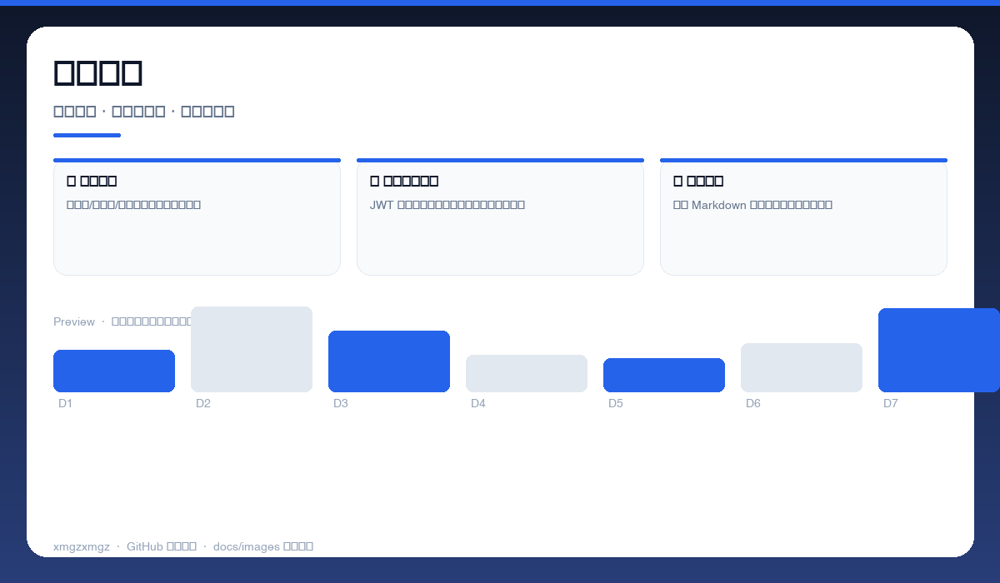
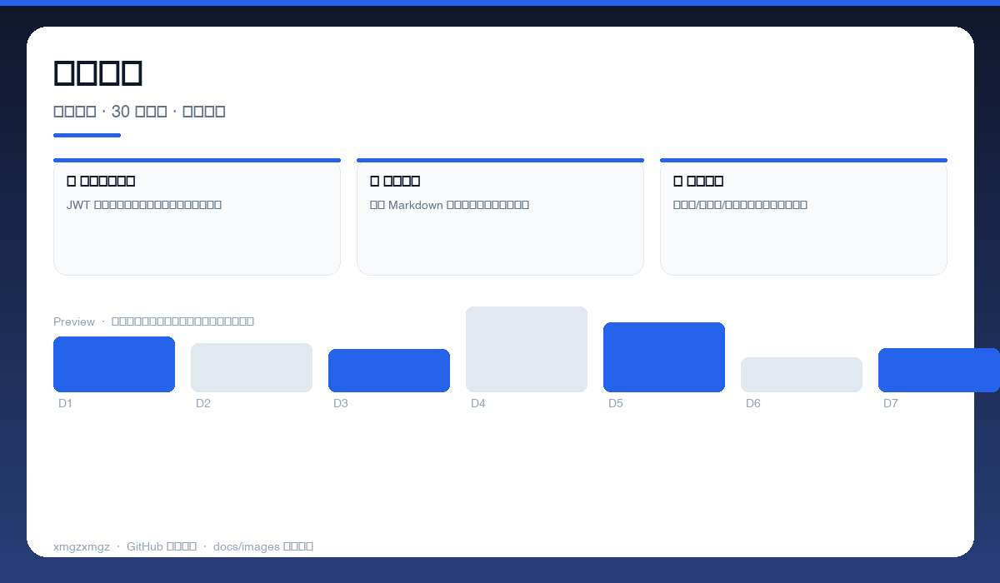
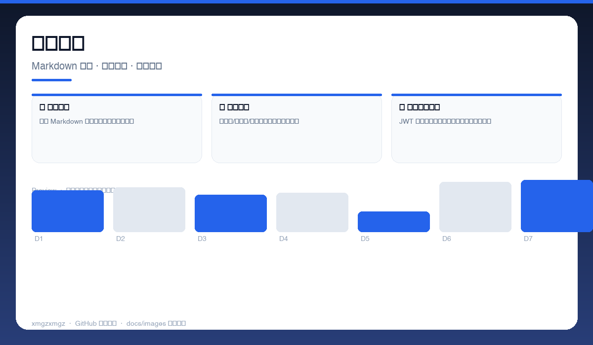

# 📊 workbuddy-account-dashboard — workbuddy-account-dashboard

> WorkBuddy 账户的轻量看板 — 本地只读登录态，积分与有效期一目了然。

[](https://github.com/xmgzxmgz/workbuddy-account-dashboard)
[](https://github.com/xmgzxmgz/workbuddy-account-dashboard/releases)
[](LICENSE)
[](https://github.com/xmgzxmgz/workbuddy-account-dashboard/actions/workflows/release.yml)

---

## ✨ 功能一览

| 模块 | 能力 | 状态 |
|------|------|------|
| 💳 积分全景 | 权益包/体验版/总量分卡展示，到期预警 | ✅ |
| 🔑 登录态有效期 | JWT 解析与剩余天数圆环，直观掌握有效期 | ✅ |
| 📄 一键报告 | 导出 Markdown 快照，备份与排错好帮手 | ✅ |

---

## 📸 功能预览

> 以下为自动生成的示意预览（无需本地部署截图），展示核心功能形态。

| 总览 | 细节 | 流程 |
|------|------|------|
|  |  |  |
| 账户全景 · 积分卡片 · 到期时间轴 · 登录态圆环 | 资源明细 · 套餐明细 · 30 天预警 · 详情展开 | 导出报告 · Markdown 快照 · 一键复制 · 本地备份 |

<details>
<summary>查看大图</summary>


</details>

---

## 🚀 快速开始

```bash
直接打开 index.html 即可（纯静态）
# 或
npx serve .
```

---

## 🛠 技术栈

HTML · JavaScript · Local-First · No Backend · JWT Parsing

---

## 🗂️ 目录结构（节选）

```
workbuddy-account-dashboard/
├── docs/images/        # 本 README 的三张自动生成预览图
├── .github/workflows/  # Auto Release 自动发版
├── README.md
└── ...                 # 源码与配置
```

---

## 📦 Releases

本仓库已启用 **Auto Release**（`.github/workflows/release.yml`）：

- 推送 `v*` tag 自动发版：`git tag v0.2.0 && git push origin v0.2.0`
- 手动触发：`gh workflow run "Auto Release" -f version=v0.2.0`（留空则自动 patch +1）
- 变更说明自动生成（`--generate-notes`）

前往 [Releases](https://github.com/xmgzxmgz/workbuddy-account-dashboard/releases) 查看。

---

## 🙏 相关项目

- [workbuddy-account-hub](https://github.com/xmgzxmgz/workbuddy-account-hub) — WorkBuddy 账户中枢（本 README 的样板）
- 更多见 [xmgzxmgz 主页](https://github.com/xmgzxmgz)

---

## 许可

MIT
